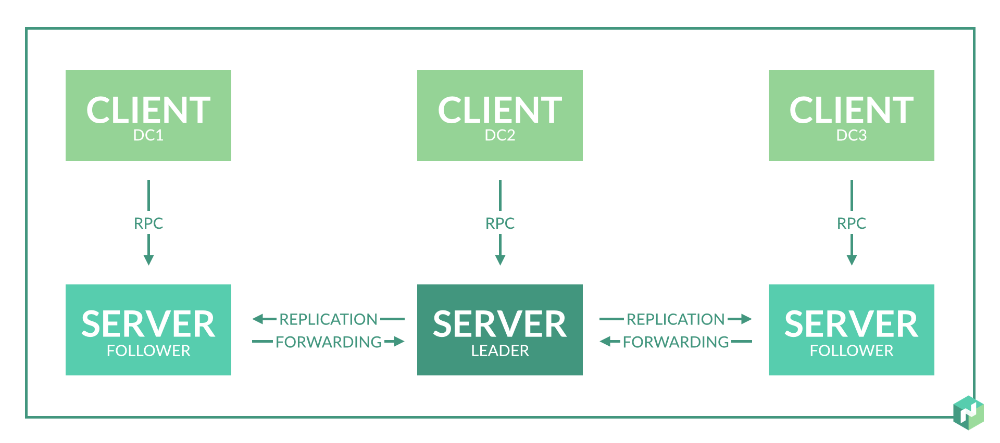
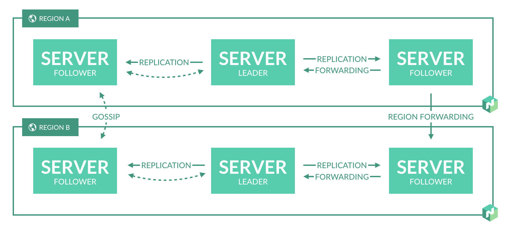
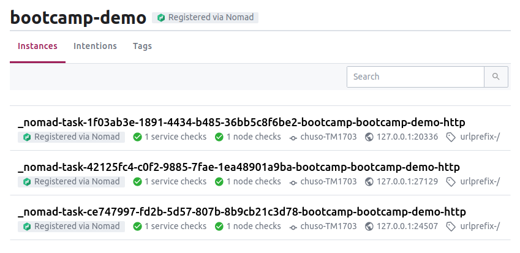

# Nomad

[*Nomad*](https://www.nomadproject.io/) es el sistema desarrollado por Hashicorp que permite orquestar el despliegue y gestión de aplicaciones tanto si están en contenedores como si no.

Este proyecto dispone de una versión de código abierto completamente usable. Algunas características, como los _namespaces_ o imposición de _quotas_ en recursos solo están disponibles en la [versión Enterprise](https://www.hashicorp.com/resources/why-should-i-consider-nomad-enterprise).

Si bien ambos son orquestadores de contenedores, existen importantes [diferencias entre Nomad y Kubernetes](https://www.nomadproject.io/intro/vs/kubernetes/):

* Kubernetes incorpora _Service Dicovery_. Nomad necesita una herramienta externa para esto, como [Consul](https://www.consul.io/).
* Kubernetes incorpora gestión de secretos. Nomad necesita una herramienta como [Vault](https://www.vaultproject.io/).
* Kubernetes está principalmente enfocado en Docker. Nomad se apoya en el concepto de *Driver* para generalizar diferentes entornos de ejecución. Por ejemplo, puede correr una aplicación Java que no está dockerizada.

Hashicorp hace productos que reducen el vendor locking. En mi empresa usamos Terraform y Packer.

## [Arquitectura de Nomad](https://www.nomadproject.io/docs/internals/architecture/)

### Jobs
Para que los usuarios definan el estado deseado de una aplicación se usará un [**Job**](https://www.nomadproject.io/docs/job-specification/), y *Nomad* se encargará de que se satisfaga dicho estado. Estos Jobs se componen de un o más **Task Groups**, que no son más que conjuntos de tareas, *Tasks*, que se ejecutan juntas. Una **Task** es la unidad mínima de ejecución, y puede funcionar sobre diferentes medios: Docker, Java, un binario, etc. A estos medios se les llama [**Driver**](https://www.nomadproject.io/docs/drivers/).

### Clientes y Servidores
Tenemos dos tipos de máquinas: clientes y servidores. Los clientes no son más que máquinas que ejecutan **Tasks**. Estos, a través de llamadas RPC:
* Se registran en los **servidores**. Determinan automáticamente los recursos de la máquina, así como los *drivers* disponibles, e informan a los servidores de ello.
* Vigilan qué operaciones se les asignan y qué **Tasks** deben realizan. 

Los servidores son las máquinas que se encargan de:
* Administrar *Jobs* y clientes
* De evaluar qué acciones se deben llevar a cabo (**Evaluations**)
* De asignar clientes a *task groups* (**Allocation**). Cada *instancia* de un *task group* será un *allocation*.

Para que una máquina sea cliente o servidor, se le instalará el agente *Nomad*, el cual puede funcionar tanto en modo cliente como servidor.

Los jobs pueden definir restricciones. El *scheduler* (https://www.nomadproject.io/docs/internals/scheduling/scheduling/) considerará estas restricciones para trate de maximizar la eficiencia en el uso de recursos, asignando los jobs al menor número posible de *clientes* (el problema bin packing: https://en.wikipedia.org/wiki/Bin_packing_problem).

Para enviar trabajos a los servidores, los usuarios podrán hacer uso tanto del Nomad CLI como de la API.

### Datacenters y regiones

*Nomad* maneja el concepto de datacenter y de región. En una región tendremos uno o más datacenters, y a cada *server* se le asigna una *región*. Los servidores de una región forman lo que se llama un **Consensus Group**, lo que significa que en conjunto elegirán un **leader** (usando el **Consensus protocol** https://www.nomadproject.io/docs/internals/consensus/ basado en Raft https://raft.github.io/) que replicará los datos entre el resto de servidores (**followers**). Para alcanzar un equilibrio entre rendimiento y alta disponibilidad, se recomienda que en cada región haya o bien tres o bien cinco servidores.



En algunos casos, por disponibilidad o escalabilidad, se desará tener más de una región. Estas son totalmente independientes entre sí, pero se pueden comunicar utilizando el Gossip Protocol (https://www.nomadproject.io/docs/internals/gossip), el cual permite a los usuarios enviar un *Job* o realizar una consulta a cualquier región de manera transparente.



## Demo 1 - Crear un job

### Instalación del agente Nomad
Está desarrollado en Go (podemos ver el proyecto en GitHub https://github.com/hashicorp/nomad) y basta con descargar el binario universal (https://www.nomadproject.io/downloads/). Puede funcionar tanto en una nube pública AWS o Azure (vía Terraform), como en local (también vía Vagrant).

Además de instalar el binario `nomad`, debemos también instalar y lanzar `consul`. Para el propósito de esta guía, basta con lanzarlo de la siguiente manera: `consul agent -dev`.

### Arrancar el agente
Además del modo *cliente* y *servidor*, el agente *Nomad* también puede funcionar en un tercer modo, *development*, mediante el cual el nodo funciona tanto como cliente como servidor. Esto está desaconsejado, pero es útil para probar jobs o para el prototipado de interacciones.

Para levantarlo, ejecutaremos el comando [`nomad agent`](https://www.nomadproject.io/docs/commands/agent/): `sudo nomad agent -dev`

Nos mostrará información relevante:

```
==> No configuration files loaded
==> Starting Nomad agent...
==> Nomad agent configuration:

       Advertise Addrs: HTTP: 127.0.0.1:4646; RPC: 127.0.0.1:4647; Serf: 127.0.0.1:4648
            Bind Addrs: HTTP: 127.0.0.1:4646; RPC: 127.0.0.1:4647; Serf: 127.0.0.1:4648
                Client: true
             Log Level: DEBUG
                Region: global (DC: dc1)
                Server: true
               Version: 0.11.3

==> Nomad agent started! Log data will stream in below:
```

En caso de que estuviéramos en un entorno en producción, lanzaríamos el agente en cada una de las máquinas deseadas, bien como servidor, bien como cliente. Al lanzarlo como servidor, debemos indicar el `data_dir`, que es el directorio donde el servidor almacena el estado del cluster: `sudo nomad agent -server -data-dir=/opt/nomad/data/`

Al lanzarlo como cliente, debemos indicar el `data_dir`, donde se guardará información del cluster entre otros: `sudo nomad agent -client -data-dir=/opt/nomad/data/`

Para obtener información de los nodos cliente lanzaremos `nomad node status`. Con el modo `-dev`, solo tendremos uno:

```
ID        DC   Name          Class   Drain  Eligibility  Status
97c95ca0  dc1  chuso-TM1703  <none>  false  eligible     ready
```

Y para obtener información sobre los servidores, lanzaremos `nomad server members`. Con el modo `-dev`, de nuevo, solo tendremos uno:

```
Name                 Address    Port  Status  Leader  Protocol  Build   Datacenter  Region
chuso-TM1703.global  127.0.0.1  4648  alive   true    2         0.11.3  dc1         global
```

### Definir un Job
Los *Jobs* en *Nomad* son las unidades que definen un estado deseado. Se definen en ficheros mediante una sintaxis declarativa, o bien en JSON o bien en HCL ([Hashicorp Configuration Language](https://github.com/hashicorp/hcl)).

Cada fichero puede contener un único *Job*, al que se le asignará un nombre único.

Tenemos los [tipos de Job](https://www.nomadproject.io/docs/schedulers/), que impactarán a cómo el scheduler decida asignar sus tareas a los nodos:
* `service`. Pensado para programar servicios que corren indefinidamente.
* `batch`. Tareas menos sensibles a la performance, y con una duración que puede ir desde unos pocos minutos hasta varios días.
* `system`. Estos jobs deben ejecutarse en todos los nodos cliente que cumplan las restricciones.

Opcionalmente, podremos definir [restricciones](https://www.nomadproject.io/docs/job-specification/constraint/), que se considerarán a la hora de elegir los nodos donde correr un job.

Mediante [`group`](https://www.nomadproject.io/docs/job-specification/group/) podemos especificar un *Tasks Group*. Entre otras propiedades, se definirán cuántas instancias se deben correr (`count`) o la política de reinicio en caso de error (`restart`). Pero el valor más importante será [`task`](https://www.nomadproject.io/docs/job-specification/task.html), que nos permite definir una tarea individual del grupo. Para cada tarea indicaremos su `driver` (por ejemplo, `docker`), su `config` (configuración específicar del driver), `resources` (requisitos que deben satisfacerse para poder correr esta tarea), `service` (instrucciones para añadir esta tarea al _Service Discovery_).

#### Job de ejemplo: servicio redis
Podemos crear un *Job* de ejemplo corriendo `nomad job init`. Creará un fichero `example.nomad` que define un *job* con nombre `example`. Su task group será el siguiente:

```
  group "cache" {
    count = 1

    restart {
      attempts = 2
      interval = "30m"
      delay = "15s"
      mode = "fail"
    }

    ephemeral_disk {
      size = 300
    }

    task "redis" {
      driver = "docker"

      config {
        image = "redis:3.2"

        port_map {
          db = 6379
        }
      }
      resources {
        cpu    = 500
        memory = 256

        network {
          mbits = 10
          port  "db"  {}
        }
      }
      service {
        name = "redis-cache"
        tags = ["global", "cache"]
        port = "db"

        check {
          name     = "alive"
          type     = "tcp"
          interval = "10s"
          timeout  = "2s"
        }
      }
    }
  }
```

Podemos ver que define una única instancia con una tarea de tipo `docker` que cargará una imagen redis `3.2` exponiendo el puerto 6379. Los recursos mínimos son 500MHz, 256MB de memoria, 10mbits por segundo de ancho de banda, y reserva un puerto dinámico atado a la etiqueta `db`. Finalmente define un servicio en `Consul`. Es el equivalente un deployment con un replicaset y un service de Kubernetes.

Para levantar este job correremos `nomad job run example.nomad`. Y una vez arrancado, podremos consultar su estado mediante `nomad status example`:

```
ID            = example
Name          = example
Submit Date   = 2020-06-21T20:36:27+02:00
Type          = service
Priority      = 50
Datacenters   = dc1
Namespace     = default
Status        = running
Periodic      = false
Parameterized = false

Summary
Task Group  Queued  Starting  Running  Failed  Complete  Lost
cache       0       0         1        0       0         0

Latest Deployment
ID          = 3a364864
Status      = successful
Description = Deployment completed successfully

Deployed
Task Group  Desired  Placed  Healthy  Unhealthy  Progress Deadline
cache       1        1       1        0          2020-06-21T20:46:45+02:00

Allocations
ID        Node ID   Task Group  Version  Desired  Status   Created    Modified
0f09c03d  06484218  cache       0        run      running  3m28s ago  3m10s ago
```

E igualmente, podremos obtener información sobre una *task* en una *allocation* particular corriendo `nomad alloc logs allocation_id task_name`. Por ejemplo, para consultar los logs de la task `redis` del ejemplo anterior, introduciríamos `nomad alloc logs 0f09c03d redis`.

En caso de que quisiéramos parar el *Job*, simplemente ejecutaríamos `nomad job stop example`.

#### Actualizar el número de réplicas
Al igual que ocurre con Kubernetes, eventualmente querremos modificar nuestra instalación, ya sea por ejemplo modificando los recursos (añadiendo réplicas) o actualizando la versión de una aplicación. Por ejemplo, podríamos querer aumentar el número de réplicas/instancias de nuestro *task group*, generando por tanto nuevas *allocations*. Para ello, editaríamos modificaríamos la propiedad `count` del fichero `example.nomad`, y cambiaríamos `1` por `3`. En primer lugar, pediríamos a *Nomad* que planificara el trabajo con `nomad job plan example.nomad`. Este comando correrá el planificador, que detectará e indicará las diferencias, pero no aplicará cambios:

```
+/- Job: "example"
+/- Task Group: "cache" (2 create, 1 in-place update)
  +/- Count: "1" => "3" (forces create)
      Task: "redis"

Scheduler dry-run:
- All tasks successfully allocated.

Job Modify Index: 10
To submit the job with version verification run:

nomad job run -check-index 10 example.nomad
```

Para enviar cambios, debemos correr el *job index* generado (160 en el ejemplo) mediante `nomad job run -check-index 10 example.nomad`. Tras esto, tendremos tres *allocations* con el servicio Redis. Si de nuevo lanzamos `nomad status example`, veremos al final todas las *allocations* (dos de ellas serán nuevas):

```
Allocations
ID        Node ID   Task Group  Version  Desired  Status   Created    Modified
7bfc220b  06484218  cache       1        run      running  24s ago    4s ago
e8aff1c2  06484218  cache       1        run      running  24s ago    10s ago
0f09c03d  06484218  cache       1        run      running  5m34s ago  13s ago
```

TODO: ¿Cómo se reparte la carga entre los tres? ¿Random? ¿Round robin?

#### Actualizar la versión de una aplicación
Si quisiéramos desplegar una nueva versión de una aplicación, tendremos que actualizar la `task`. Siguiente el ejemplo anterior, podríamos actualizar de la redis `3.2` a la `4.0`.

En el despliegue, será fundamental la configuración del apartado [`update`](https://www.nomadproject.io/docs/job-specification/update/) de *Job*, donde indicaremos la estrategia de actualización (_Rolling Upgrades_, _Blue-Green Deployment_, _Canary Releases_, etc) que deseamos utilizar. Los valores del ejemplo son:

Si editamos el fichero `example.nomad`, cambiamos la versión de redis a la `4.0`, y corremos `nomad job run example.nomad`, veremos que progresivamente se van actualizando los nodos de uno en uno, hasta que tengamos tres nodos con la versión `2` en lugar de la `1`:

```
Allocations
ID        Node ID   Task Group  Version  Desired  Status    Created     Modified
eb272aaf  06484218  cache       2        run      running   2m25s ago   2m5s ago
f9f42f45  06484218  cache       2        run      running   2m39s ago   2m26s ago
7a6dc541  06484218  cache       2        run      running   3m6s ago    2m41s ago
```

Esta es la estrategia de `update` que por defecto nos ha generado el ejemplo en `example.nomad`:
```
  update {
    max_parallel = 1
    min_healthy_time = "10s"
    healthy_deadline = "3m"
    progress_deadline = "10m"
    auto_revert = false
    canary = 0
  }
```

Indica que se actualizarán de 1 en 1 (`max_parallel`), no actualizando el siguiente hasta que se superan 10 segundos en estado `healthy` (`min_healthy_time`). A esta estrategia de despliegue se le conoce como **Rolling Upgrade**.

## Demo 2 - Crear un servicio web accesible tras un proxy inverso
*Nomad* no incorpora un servicio de proxy inverso integrado que pueda hacer balanceo de carga, a diferencia de Kubernetes que incorpora Ingress, sino que hay que instalar un Job que realice esta función. Existen guías en la documentación oficial para hacer [Load-Balancing en *Nomad* con HAProxy, NGINX y Traefik](https://learn.hashicorp.com/nomad/load-balancing/lb-considerations), sin embargo opté por [Fabio](https://fabiolb.net/), pues de acuerdo a la guía oficial de [cómo crear un load balancer entre Nomad y Fabio](https://learn.hashicorp.com/nomad/load-balancing/fabio), este se configura a sí mismo de manera nativa a partir de la configuración de Consul. Tan solo hay que añadir el tag `urlprefix-/uri` a los servicios *Nomad*, y Fabio hará el resto (por ejemplo, el tag `urlprefix-/demo` vincula el path `/path` al servicio que defina el tag).

### Job bootcamp
Siguiendo el ejemplo visto en clase, se ha creado un *Job* con el contenedor `kubernetes-bootcamp`:
```
job "demo" {
  datacenters = ["dc1"]
  type = "service"
  group "demo" {
    count = 3
    task "bootcamp" {
      driver = "docker"
      config {
        image = "jocatalin/kubernetes-bootcamp:v1"
        port_map {
          http = 8080
        }
      }
      resources {
        network {
          mbits = 10
          port "http" {}
        }
      }
      service {
        name = "bootcamp-demo"
        tags = ["urlprefix-/"]
        port = "http"
        check {
          type     = "http"
          path     = "/"
          interval = "10s"
          timeout  = "2s"
        }
      }
    }
  }
}
```

En este caso creamos 3 instancias del *Task group* `demo`. Cada una, tan solo tiene una *task* de tipo docker, donde se mapea un puerto aleatorio al alias `http`. Se registra cada uno en un service de nombre `bootcamp-demo`, y los mapeamos a la url `/` de Fabio.

Si cargamos el dashboard de Consul, veremos todas las instancias del servicio:



### Job Load Balancer
Para el load balancer, creamos un nuevo job, de tipo `system`. En el puerto `9999` estará el load-balancer, y en el `9998` la interfaz web.

```
job "fabio" {
  datacenters = ["dc1"]
  type = "system"

  group "fabio" {
    task "fabio" {
      driver = "docker"
      config {
        image = "fabiolb/fabio"
        network_mode = "host"
      }

      resources {
        cpu    = 200
        memory = 128
        network {
          mbits = 20
          port "lb" {
            static = 9999
          }
          port "ui" {
            static = 9998
          }
        }
      }
    }
  }
}
```

Una vez cargado, si invocamos `curl http://127.0.0.1:9999/`, comprobamos que cada vez nos atiende una instancia.

